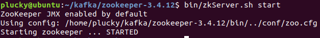
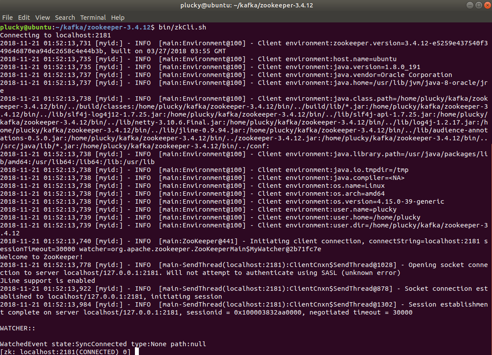
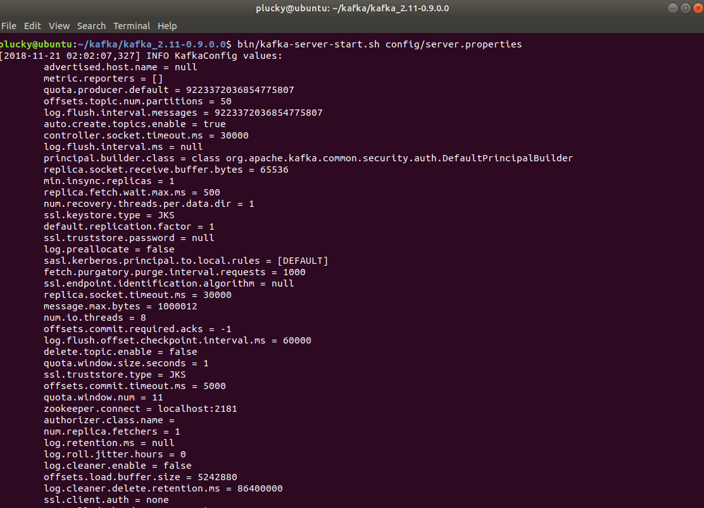
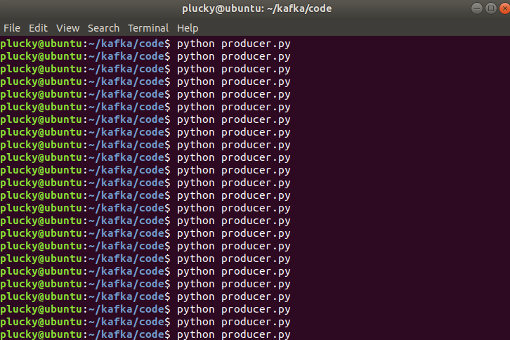
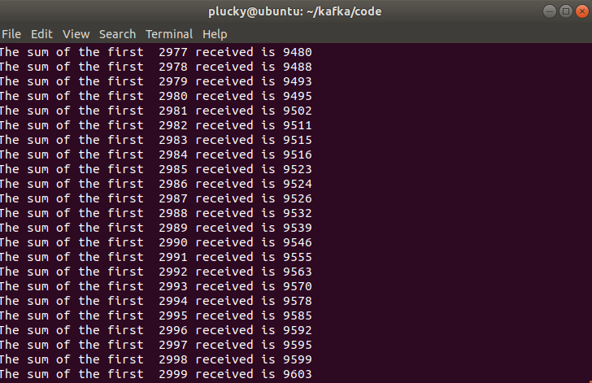

# Homework 3B-3D: Kafka's installation and applications

## 1. Setup 

**Note：**

- Ubuntu 18.04 is used for this project.
- JDK 8 is recommended. Error may occur when using higher JDK versions.

#### 1.1. Zookeeper setup

Zookeeper is the one of the dependencies and required frameworks of Kafka. 

**Step 1:** Download and extract Zookeeper.

-  Visit <http://zookeeper.apache.org/releases.html> and download the Zookeeper installation package.

- Extract Zookeeper

  ```shell
  $ tar -zxf zookeeper-3.4.12.tar.gz
  $ cd zookeeper-3.4.12
  ```

**Step 2:** Setup configurations.

```shell
$ mkdir data
$ vim conf/zoo.cfg
tickTime=2000
dataDir=../data
clientPort=2181
initLimit=5
syncLimit=2
```

**Step 3:** Start and connect to the Zookeeper server.

- Start the server

  ```shell
  $ bin/zkServer.sh start
  ```

- The result is shown as follows.



- Start the CLI which will connect to the server

  ```shell
  $ bin/zkCLI.sh 
  ```

  

- It shows that Zookeeper has been successfully installed.

#### 1.2. Kafka Setup

**Step 1:** Download and extract the package.

- Visit <https://www.apache.org/dyn/closer.cgi?path=/kafka/0.9.0.0/kafka_2.11-0.9.0.0.tgz> and download the Kafka package.

- Extract the package.

  ```shell
  $ tar -zxf kafka_2.11.0.9.0.0 tar.gz
  $ cd kafka_2.11.0.9.0.0
  ```

**Step 2:** Start the server.

- A Zookeeper server should be started beforehand.

  ```shell
  $ bin/zookeeper-server-start.sh config/zookeeper.properties
  ```

- Then start the Kafka server.

  ```shell
  $ bin/kafka-server-start.sh config/server.properties
  ```

- Lots of logs are shown in the shell. We just post a part of them.

  


## 2. Consumer and Producer

#### 2.1. Setup

- We use python 2.7 to develop the producer and consumer

- First, we install the Kafka package of python

  ```shell
  $ pip install kafka
  ```

#### 2.2. Start the *Topic*

- We start a new topic named "counter"

  ```shell
  $ bin/kafka-topics.sh --create --zookeeper localhost:2181 --replication-factor 1 --partitions 1 --topic counter
  ```

#### 2.3. The producer

- The producer is to generate 100 random integers once at a time, and send them to the "counter" topic.

  ```python
  from kafka import KafkaProducer
  import random

  producer = KafkaProducer(bootstrap_servers='localhost:9092')

  for i in range(100):
      num = str(random.randrange(0, 10))

      producer.send('counter', str.encode(num))

  producer.close()
  ```

#### 2.4. The consumer

- The consumer collects the data produced by the producer, and calculate the sum of them.

  ```python
  from kafka import KafkaConsumer

  tot = 0
  consumer = KafkaConsumer('counter', bootstrap_servers=['localhost:9092'])

  for msg in consumer:
      recv = "%s:%d:%d: key=%s value=%s" % (msg.topic, msg.partition, msg.offset, msg.key, msg.value)
      tot += int(msg.value)
      print "The sum of the first ", msg.offset, "received is", tot
  ```

#### 2.5. Results

- First we run *consumer.py* to listen to all messages.

- Then, we repeatedly run *producer.py* in another terminal to send a lot of numbers to the topic.

- Part of the results is shown as follows.

  

  

  ​

  ## 3. Streaming Processing

  #### 3.1 Concept

  ​

  ​