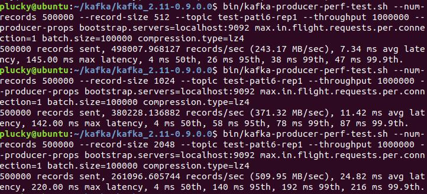

# Homework 3B-3D: Kafka's installation and applications

## 1. Setup 

**Note：**

- Ubuntu 18.04 is used for this project.
- JDK 8 is recommended. Error may occur when using higher JDK versions.

#### 1.1. Zookeeper setup

Zookeeper is the one of the dependencies and required frameworks of Kafka. 

**Step 1:** Download and extract Zookeeper.

-  Visit <http://zookeeper.apache.org/releases.html> and download the Zookeeper installation package.

- Extract Zookeeper

  ```shell
  $ tar -zxf zookeeper-3.4.12.tar.gz
  $ cd zookeeper-3.4.12
  ```

**Step 2:** Setup configurations.

```shell
$ mkdir data
$ vim conf/zoo.cfg
tickTime=2000
dataDir=../data
clientPort=2181
initLimit=5
syncLimit=2
```

**Step 3:** Start and connect to the Zookeeper server.

- Start the server

  ```shell
  $ bin/zkServer.sh start
  ```

- The result is shown as follows.


- Start the CLI which will connect to the server

  ```shell
  $ bin/zkCLI.sh 
  ```

  

- It shows that Zookeeper has been successfully installed.

#### 1.2. Kafka Setup

**Step 1:** Download and extract the package.

- Visit <https://www.apache.org/dyn/closer.cgi?path=/kafka/0.9.0.0/kafka_2.11-0.9.0.0.tgz> and download the Kafka package.

- Extract the package.

  ```shell
  $ tar -zxf kafka_2.11.0.9.0.0 tar.gz
  $ cd kafka_2.11.0.9.0.0
  ```

**Step 2:** Start the server.

- A Zookeeper server should be started beforehand.

  ```shell
  $ bin/zookeeper-server-start.sh config/zookeeper.properties
  ```

- Then start the Kafka server.

  ```shell
  $ bin/kafka-server-start.sh config/server.properties
  ```

- Lots of logs are shown in the shell. We just post a part of them.

  


## 2. Consumer and Producer

#### 2.1. Setup

- We use python 2.7 to develop the producer and consumer

- First, we install the Kafka package of python

  ```shell
  $ pip install kafka
  ```

#### 2.2. Start the *Topic*

- We start a new topic named "counter"

  ```shell
  $ bin/kafka-topics.sh --create --zookeeper localhost:2181 --replication-factor 1 --partitions 1 --topic counter
  ```

#### 2.3. The producer

- The producer is to generate 100 random integers once at a time, and send them to the "counter" topic.

  ```python
  from kafka import KafkaProducer
  import random

  producer = KafkaProducer(bootstrap_servers='localhost:9092')

  for i in range(100):
      num = str(random.randrange(0, 10))

      producer.send('counter', str.encode(num))

  producer.close()
  ```

#### 2.4. The consumer

- The consumer collects the data produced by the producer, and calculate the sum of them.

  ```python
  from kafka import KafkaConsumer

  tot = 0
  consumer = KafkaConsumer('counter', bootstrap_servers=['localhost:9092'])

  for msg in consumer:
      recv = "%s:%d:%d: key=%s value=%s" % (msg.topic, msg.partition, msg.offset, msg.key, msg.value)
      tot += int(msg.value)
      print "The sum of the first ", msg.offset, "received is", tot
  ```

#### 2.5. Results

- First we run *consumer.py* to listen to all messages.

- Then, we repeatedly run *producer.py* in another terminal to send a lot of numbers to the topic.

- Part of the results is shown as follows.

  

  


## 3. Quantitative analyzing

#### 3.1. Producer test

- We use bin/kafka-producer-perf-test.sh to test the producer.
- First, we create two brokers and several topics with different partition number and replication number to meet our test requests.
- We use different partition numbers, replication numbers, batch sizes and record sizes to test the producer, and the results are as follows.
- Here are test results with different partition numbers. We can see that the larger the partition number is, the lower the throughput(records/sec) will be.


- Here are test results with different replication numbers. We can see that the larger the replication number is, the lower the throughput(records/sec) will be.


- Here are test results with different batch sizes. We can see that the larger the batch size is, the higher the throughput(records/sec) will be. However, we can still see that if the batch size is larger than 30000, the throughput barely increases.


- Here are test results with different record sizes. We can see that the larger the record size is, the lower the throughput(records/sec) will be.



#### 3.2. Consumer test

- We use bin/kafka-consumer-perf-test.sh to test the consumer.

- We use different partition numbers and thread numbers to test the consumer, and the results are as follows.

- Here are test results with different partition numbers. We can see that the larger the partition number is, the lower the throughput(records/sec) will be.


- Here are test results with different thread numbers. We can see that the more the threads are, the higher the throughput(records/sec) will be.


## 4. Streaming Processing

#### 4.1 A Scenario of Order Collection and Delivery

- Suppose our Kafka cluster serves in an online-shopping system. Our Kafka server is a request middleware which accepts various types of requests and stores them by category in different topics, Kafka producer is a request collector that forwards requests from realistic customers in different regions to the same Kafka server, and Kafka consumer fetches requests data from server to take different actuating logics for each category.
- For simplification, we use threads to simulate producers in various regions, and there are 2 types of request - 'order' and 'cancel'. For an 'order' request,  producer will provide its ID and account of money, for 'cancel' request, producer will only provide ID information.
- Also for simplification, we only print different messages for there 2 kinds of order in place of different processing logics.

#### 4.2 Producer

- The producer creates 4 threads using procedure 'mainloop', mostly they send an 'order' request to server, while there is also possibility to send a 'cancel' request instead.

```python
# ng=utf-8

from kafka import KafkaProducer
import time
import random
from multiprocessing import Process, Lock, Manager
from multiprocessing.sharedctypes import Value
import os


def mainloop(tid, lock):
    random_section = 15
    cancel_id = -1
    producer = KafkaProducer(bootstrap_servers=['127.0.0.1:9092'])
    while True:
        with lock:
            id.value = id.value + 1
            this_id = id.value

        if (this_id % random_section == 0):
            random_section = random.randrange(15, 40)
            cancel_id = this_id + random.randrange(0, 20)

        money = random.randrange(15, 4000)
        if (this_id != cancel_id):
            msg = "collector %d send request id %d, money %d, " % (tid, this_id, money)
            sendmsg = "%d,%d" % (this_id, money)
            producer.send('order', sendmsg.encode('utf-8'))
        else:
            msg = "collector %d send cancel id %d, " % (tid, this_id)
            sendmsg = "%d" % this_id
            producer.send('cancel', sendmsg.encode('utf-8'))

        print(msg)
        time.sleep(1)
    producer.close()


if __name__ == "__main__":
    threads = []

    lock = Lock()
    manager = Manager()
    id = manager.Value('tmp', 0)

    for ll in range(4):
        t = Process(target=mainloop, args=(ll, lock))
        t.daemon = True
        threads.append(t)

    for i in range(len(threads)):
        threads[i].start()

    for j in range(len(threads)):
        threads[j].join()

    print 'All subprocesses finish Processing.'
```

#### 4.3 Consumer

- There are two consumers: cancel consumer and order consumer. The former one only prints ID , while the ladder one prints both ID and money together out.	

  ```python
  from kafka import KafkaConsumer
  
  consumer = KafkaConsumer('cancel', group_id='my_group', bootstrap_servers=['127.0.0.1:9092'])  
  
  for message in consumer:
     print("%s:%d:%d: key=%s id=%s" % (message.topic, message.partition, message.offset, message.key, message.value))
  ```

  ```python
  from kafka import KafkaConsumer
  
  consumer = KafkaConsumer('order', group_id='my_group', bootstrap_servers=['127.0.0.1:9092'])  
  
  for message in consumer:
     list  = message.value.split(',');
     print("%s:%d:%d: key=%s id=%s money=%s" % (message.topic, message.partition, message.offset, message.key, list[0], list[1]))
  ```

#### 4.4 Tests

##### 4.4.1 fisrt test

- Let producer run for a while, then start the consumer to fetch the requests. As below, 4 producer threads produce a total of 31 requests in such order. Then we stop the process using CTRL+Z.


- Then we start request consumer. Interestingly, **nothing happens**. The customer **didn't get anything from producer**. 

  

- When we resume the producer, this time consumer fetches data successfully, but only from ID 33, the old requests somehow disappear.

  Also, we can see that **the order of requests received by consumer is not the same as the messages print by producer**. It seems not to be streamingly processed.

  

  

- When we stop and resume the producer, leaving customer active, customer has no action.

- When we **resume the producer again, customer gets new data immediately**.

  

  

- When we stop the customer and leave producer active, waiting for producer for seconds, then resume customer, we get new requests data soon.

  

  

- Notice that this time we produce a 'cancel' request, so we start cancel consumer to try to get it.

  Again it somehow loses, we didn't get anything.

  

- Resume producer and wait for another cancel request. Cancel consumer gets it this time.

  

  

##### 4.4.2 modify producer and test again

- we find that our print and send is not locked together before, so we change the code to below:

```python
if (this_id != cancel_id):
    msg = "collector %d send request id %d, money %d, " % (tid, this_id, money)
    sendmsg = "%d,%d" % (this_id, money)
    with lock:
        print(msg)
        producer.send('request', sendmsg.encode('utf-8'))
else:
    msg = "collector %d send cancel id %d, " % (tid, this_id)
    sendmsg = "%d" % this_id
    with lock:
        print(msg)
        producer.send('cancel', sendmsg.encode('utf-8'))
```

- This time, everything goes in order.


- So, the consumer do gets requests in the same order that the producer writes. This proves that Kafka really process in the stream.