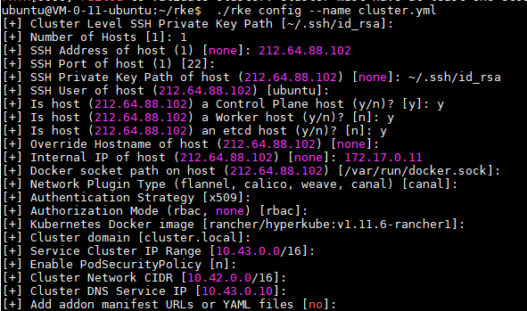
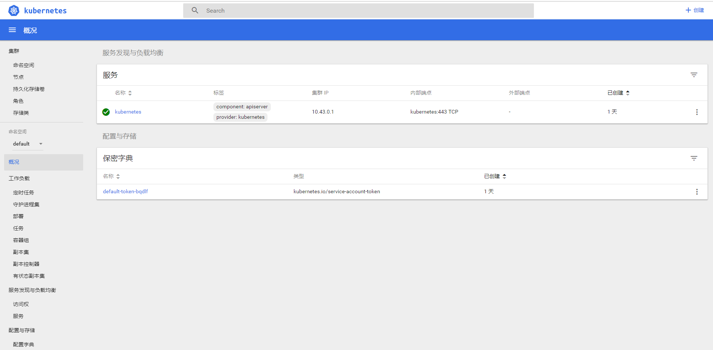

### Requirement II

- Prepare a Kubernetes environment

#### Environment 

- Virtual machine on Tencent cloud
- Ubuntu 16.04

#### Step 1. Docker setup

- Docker 18.x may not work with the current version of RKE.

- ```shell
  $ curl https://releases.rancher.com/install-docker/17.03.sh | sh
  ```

- Use `docker --version` to check whether docker is successfully installed.

- ```shell
  # to allow docker without sudo 
  $ sudo usermod -aG docker your_username
  ```

#### Step 2. SSH authorization

- Add ssh public key to `authorized_keys` 

- ```shell
  $ cd ~/.ssh
  $ ssh-keygen
  $ cat id_rsa.pub >> authorized_keys
  ```

#### Step 3. RKE setup

- Download the package

```shell
$ cd ~
$ mkdir rke
$ cd rke
# download package
$ wget https://github.com/rancher/rke/releases/download/v0.1.15/rke_linux-amd64
# rename the file
$ mv ./rke-download ./rke
$ chmod 777 ./rke
```

- Config RKE, note that the host should be the plane host, worker host and etcd host.

  ```shell
  $ ./rke config --name cluster.yml 
  ```

- A configuration for reference is as follows.

- Create the RKE cluster

  ```shell
  $ cd ~/rke
  $ ./rke up
  ```

  A message will show that whether RKE has been successfully started.

#### Step 4. Kubectl setup

- Select a correct version at https://github.com/kubernetes/kubernetes/blob/master/CHANGELOG-1.13.md#client-binaries and copy the download link. (We choose `kubernetes-client-linux-amd64.tar.gz`)

  ```shell
  $ wget https://dl.k8s.io/v1.13.1/kubernetes-client-linux-amd64.tar.gz
  $ tar -zxvf kubernetes-client-linux-amd64.tar.gz
  $ cd kubernetes/client/bin
  $ chmod 777 ./kubectl
  $ sudo mv ./kubectl /usr/local/bin/kubectl
  ```

- Prepare a `kubernetes_dashboard.yaml` file.

- Use `kubectl create -f kubernetes_dashboard.yaml` to start the dashboard.

- The dashboard is now running on the 30090 port (which can be configured in the .yaml file). Visit it via browser.

- 

