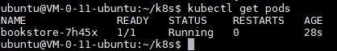

# Requirement 3

### k8s ReplicationController和Service配置

通过之前的CI/CD，我们在每次提交时会自动bookstore的docker image，现在我们就可以通过rc和svc的配置将该应用部署到Kubernetes中去。

- ReplicationController配置

  创建bookstore-rc.yaml文件如下：

  ```yaml
  apiVersion: v1
  kind: ReplicationController
  metadata:
    name: bookstore
  spec:
    replicas: 1
    selector:
      app: bookstore
    template:
      metadata:
        labels:
          app: bookstore
      spec:
        containers:
        - name: bookstore
          image: bookstore
          imagePullPolicy: Never
          ports:
          - containerPort: 12306
  ```

  之后运行`kubectl create -f bookstore-rc.yaml`，这样，我们就创建好rc了。我们通过命令输入`kubectl get pods`就能够查看到程序对应的pods的启动情况：

  

  这里需要注意的是，bookstore-rc.yaml文件会自动去DockerHub上搜索镜像，然而本次项目中的镜像生成后未上传到DockerHub，而是存在本地，所以特别地，我们需要加上`imagePullPolicy: Never`来确保生成时永远从本地寻找镜像。除此之外，由于我们的服务器只有4GB内存，所以只允许我们运行一个replica，所以此次我们设置replicas的数量为1。

- Service配置

  继续创建bookstore-svc.yaml文件如下：

  ```yaml
  apiVersion: v1
  kind: Service
  metadata:
    name: bookstore
  spec:
    type: NodePort
    ports:
    - port: 12306
      targetPort: 12306
      nodePort: 30099
    selector:
      app: bookstore
  ```

  同样的，我们运行`kubectl create -f bookstore-svc.yaml`。现在我们就完成了svc的创建，并且把bookstore的端口暴露到了30099上。

  通过访问服务器的30099端口，我们能够看到之前的bookstore的界面，各项功能正常，部署成功。

### k8s配置时遇到的数据库问题

一开始运行以上两个yaml文件后，部署的pods的处于CrashLoopBackOff状态，通过查看log我们得知在连接MySQL数据库时发生了link failure。

通过查看3306端口状态我们得知：3306绑定的是本地的127.0.0.1，需要解除绑定。

我们修改MySQL的配置文件`vim /etc/mysql/mysql.conf.d/mysqld.cnf`，在`bind-address = 127.0.0.1`前加上`#`注释掉改行；然后进入mysql命令界面，输入`GRANT ALL PRIVILEGES ON *.* TO 'root'@'%' IDENTIFIED BY 'root' WITH GRANT OPTION;`开启远程连接；最后我们在腾讯云的安全组中开启TCP:3306端口。之后再查看pods的状态，变为了Running，能够正常运行。

### 将k8s的配置指令加入到Jenkins中

创建delete_create.sh如下：

```shell
#!/bin/sh
kubectl delete -f ./bookstore-rc.yaml
kubectl delete -f ./bookstore-svc.yaml
kubectl create -f ./bookstore-rc.yaml
kubectl create -f ./bookstore-svc.yaml
```

然后在Jenkins的command中加入如下指令：

```shell
cd ~/k8s
sudo ./delete_create.sh
```

之后每次进行Github的提交时便可以自动部署最新的项目了。

